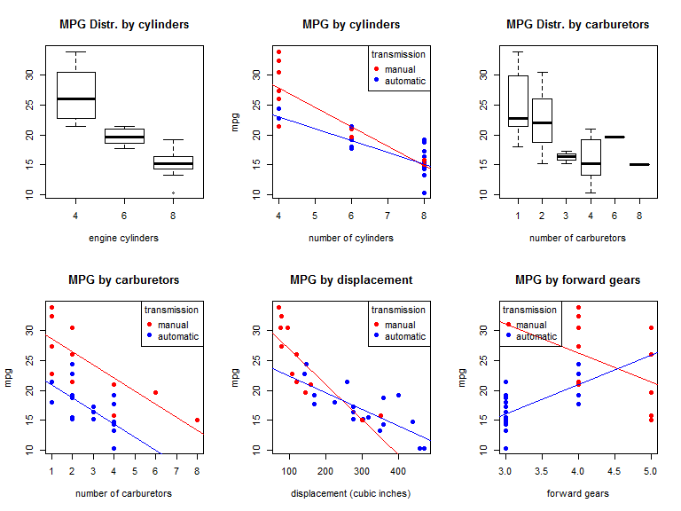

# MPG vs Transmission Type, mtcars dataset
Libardo Lopez  
Tuesday, September 16, 2014  


## Executive Summary
1. This analysis attempts to conclude about the impact of manual or automatic transmission on vehicle GPM performance, from mtcars dataset.  
1. The model predicts an improvement of **1.8** miles per gallon from a manual transmission as compared with an automatic. 
1. Suggestion: __Do not use the model's result__. It is an academic exercise and moreover, the dataset is from 1973-74 so because of time window and the technological differences from that year to today, the findings from my view, may be not valid although the analysis process it is.  
1. If you need some kind of analysis like this for a real issue, you must update the dataset and drilldown according to your needs.    
1. Note if you like to see de R code, please [Go to Github](https://github.com/Libardo1/Regression_Models)  

## Data Preprocessing
### Variables as Factor
* The variables cyl, vs, am, gear, carb are treated as factor.

### Observations from Data Exploration (see [Appendix](#exploration))
* The cars with manual vs automatic transmission are not identically distributed (see also [Additional Plots](#additionalMpgPlots)). Note the regression lines.
* From the figure MPG by weight, you can see a better performance for the manual transmission but with a greater dispersion (sd).
* For the heavier cars, the trend is to have automatic transmission.
* The MPG by HP is better for manual cars.
* For small cars i.e. 4 cyl and small displacement, the trend is to have manual transmission.

### Model selection strategy
* The analysis attempts to include only highly relevant predictors for outcome MPG, minimizing the number of predictors.
* It considers two different models; but does not consider second order (interaction) terms or exclude outliers.
* Null hypothesis: None of the regressors predict MPG performance.

#### <a name = "model1" /> Model 1: Minimize Akaike Information Criterion (AIC)
The first is the built-in R function step() which through successive iterations drops fields from the initial model including all available variables to __minimize__ the Akaike Information Criterion (AIC). Increasing the number of regressors raises the AIC; thus it attempts to balance fitting the data with minimizing regressors.  
On each step, the method eliminates the highest p-valued regressor from the model and refits. This iterative process continues until all predictors are below the significance threshold.  


## Inspecting the Model
### mpg = 33.71 + 1.81manual - 3.03cyl6 - 2.16cyl8 - 0.03hp - 2.5wt  

* The Adjusted __R squared value of 0.78__ for the start model with all variables, compared with the final model __R squared value of 0.84__ shows the final model is a good fit.
* The model include 4 predictors (manual, cyl6, cyl8, hp, wt). The model predicts manual transmission increases MPG by __1.8__ mpg .

### Observations from Residual Plots (see [Appendix](#residuals))
* As with the exploratory plots, the residual plots are clustered and do not appear identically distributed between automatic and manual transmission cars.  

# <a name = "results" />Results

* The Adjusted __R squared value of 0.78__ for the start model with all variables, compared with the final model __R squared value of 0.84__ shows the final model is a good fit.
* The model predicts a __improvement to MPG of 1.8__ mpg with a manual transmission.
* It is an academic exercise and moreover, the dataset is from 1973-74 so because of time window and the technological differences from that year to today, the findings from my view, may be not valid although the analysis process it is. 
* If you need some kind of analysis like this for a real issue, you must update the dataset and drilldown according to your needs.

## Appendix A: Figures

### <a name="exploration" />Figure A1: Data Exploration
 

### <a name="residuals" />Figure A2: Model Residuals
 

### <a name = "additionalMpgPlots" />Figure A3: Data Exploration; additional MPG plots
 

### <a name = "model2iterations" />Figure A4: Table of Backward Stepwise P-Value Iterations for Model 2

```r
model2 <- lm(mpg ~ factor(am) + factor(cyl) + factor(carb) + factor(vs) +  factor(gear) + disp + hp + drat + wt + qsec, mtcars); #Start:  AIC=76.4
model2 <- lm(mpg ~ factor(am) + factor(cyl) + factor(vs) + factor(gear) +   disp + hp + drat + wt + qsec, mtcars); #Step:  AIC=69.83; discarded: carburators
model2 <- lm(mpg ~ factor(am) + factor(cyl) + factor(vs) + disp + hp + drat+ wt + qsec, mtcars); #Step:  AIC=67; discarded: gear
model2 <- lm(mpg ~ factor(am) + factor(cyl) + factor(vs) + disp + hp + wt +     qsec, mtcars); #Step:  AIC=65.23; discarded: drat 
model2 <- lm(mpg ~ factor(am) + factor(cyl) + factor(vs) + hp + wt + qsec, mtcars); #Step:  AIC=63.51; discarded: disp
model2 <- lm(mpg ~ factor(am) + factor(cyl) + factor(vs) + hp + wt, mtcars); #Step:  AIC=62.06; discarded: qsec
model2 <- lm(mpg ~ factor(am) + factor(cyl) + hp + wt, mtcars); #Step:  AIC=61.65
```


```r
summary2
```

```
## 
## Call:
## lm(formula = mpg ~ factor(am) + factor(cyl) + hp + wt, data = mtcars)
## 
## Residuals:
##    Min     1Q Median     3Q    Max 
## -3.939 -1.256 -0.401  1.125  5.051 
## 
## Coefficients:
##              Estimate Std. Error t value Pr(>|t|)    
## (Intercept)   33.7083     2.6049   12.94  7.7e-13 ***
## factor(am)1    1.8092     1.3963    1.30   0.2065    
## factor(cyl)6  -3.0313     1.4073   -2.15   0.0407 *  
## factor(cyl)8  -2.1637     2.2843   -0.95   0.3523    
## hp            -0.0321     0.0137   -2.35   0.0269 *  
## wt            -2.4968     0.8856   -2.82   0.0091 ** 
## ---
## Signif. codes:  0 '***' 0.001 '**' 0.01 '*' 0.05 '.' 0.1 ' ' 1
## 
## Residual standard error: 2.41 on 26 degrees of freedom
## Multiple R-squared:  0.866,	Adjusted R-squared:  0.84 
## F-statistic: 33.6 on 5 and 26 DF,  p-value: 1.51e-10
```

